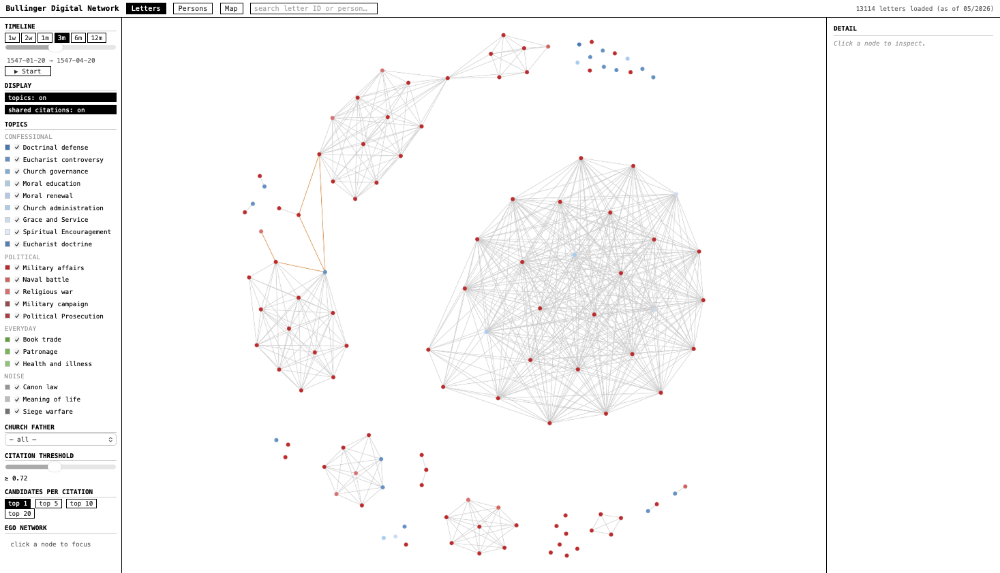

# Bullinger Correspondence Network — Interactive Visualisation
Web-based interactive visualisation of the Bullinger correspondence network, enriched with patristic citation detection and topics from topic model run.

## Running locally
```bash
# e.g.:
python -m http.server 8000
# then open http://localhost:8000
```

## Data files

```
data/
├── graph/
│   ├── letters_index.json        
│   ├── location_arcs.json
│   ├── person_edges.json
│   ├── person_topic_vectors.json
│   ├── persons_index.json
│   ├── places_index.json
│   └── psc_index.json            
├── topics/
│   └── topics_meta.json          # topic labels + colours
└── citations/ # HOSTED ON HF
    ├── letter_citations_index.json   # from aggregate_citations.py
    └── detail/
        └── {letter_id}.json          # per-letter detail, loaded on click
```

## Views

| View | Description |
|---|---|
| Letters | Force-directed graph of letters, coloured by dominant topic |
| Persons | Correspondence network of people, sized by letter count |
| Map | Geographic map of sending locations with arc volume |

## Filters

- **Timeline** — windowed slider (1w / 2w / 1m / 3m / 6m / 12m presets) with play animation
- **Topics** — toggle topic visibility
- **Church Father** — only show letters potentially referencing a specific father
- **Citation threshold** — minimum cos sim score for potential references to appear
- **Ego network** — click any node to collapse graph to that node's neighbourhood

