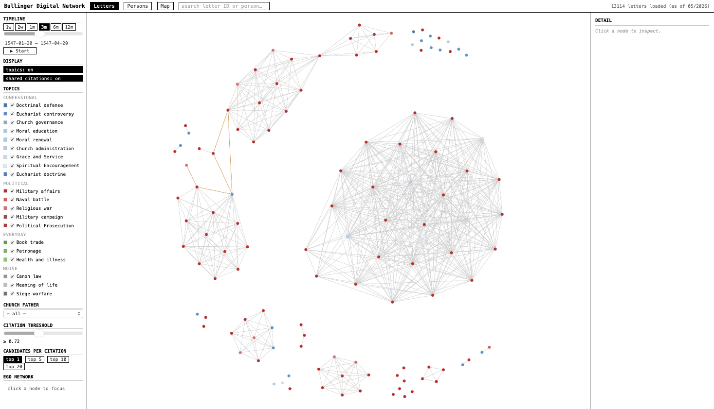

# Bullinger Correspondence Network — Interactive Visualisation
Web-based interactive visualisation of the Bullinger correspondence network with letters from [Bullinger Digital](https://www.bullinger-digital.ch/), enriched with patristic reference candidates and topics from topic model run.

## Running locally
```bash
# e.g.:
python -m http.server 8000
# then open http://localhost:8000
```

### Reusing web app
Swap the JSON files; topics and citations are optional.

### Data files

```
data/
├── graph/
│   ├── letters_index.json        
│   ├── location_arcs.json
│   ├── persons_index.json
│   ├── places_index.json
│   └── psc_index.json            # "fathers" [] if unused
├── topics/
│   └── topics_meta.json          # topic labels + colours / "topics" [] if unused
└── citations/ # HOSTED ON HF
    └── detail/
        └── {letter_id}.json          # per-letter detail, loaded on click
```

### Minimal schemas
 
**letters_index.json** — array of:
```json
{
  "id": "10001", "date": "1531-08-17",
  "sender_id": "p8081", "recipient_ids": ["p495"], "place_id": "pl210",
  "bd_url": "https://www.bullinger-digital.ch/letter/10001", // replace with own source url or keep empty
  "dominant_topic": 13,          // keep empty if no topics
  "topic_dist": [0.054711, 0.046107,..],    // keep empty if no topics
  "top_citations": [{ "cf_id": "aug", "work_id": "aug_conf", "ce_score": 0.82 }]  // keep empty if no citations
}
```
**location_arcs.json** — array of `{ "source_place", "target_place", "weight", "letter_ids": [...] }` — can be `[]`

**persons_index.json** — array of `{ "id", "name", "letter_count", "portrait", "wiki", "gnd"} // portrait, wiki, gnd = optional`
 
**places_index.json** — array of `{ "id", "name", "country", "lat", "lon" }`
 
**psc_index.json** — `{ "fathers": [{ "id", "name", "works": [{ "work_id", "title", "source_url" }] }] }` — can be `[]`
 
**topics_meta.json** — `{ "topics": [{ "id", "label", "color", "theme", "top_words": [...] }] }` — can be `[]`

### Things to update in app.js
 
| Line | What | Change to |
|------|------|-----------|
| 31 | `DETAIL_BASE_URL` | your detail file host |
| 255, 304, 369 | `BULLINGER = "p495"` | your hub person's ID |
| 319 | `<= 30 * 86400000` | edit the days for epistolary edges (ongoing conversations) |
| 919-956 | theme list in `buildTopicFilters()` | edit topic themes (or remove grouping) |

## Views

| View | Description |
|---|---|
| Letters | Force-directed graph of letters, coloured by dominant topic |
| Persons | Correspondence network of people, sized by letter count |
| Map | Geographic map of sending locations |

## Filters

- **Timeline** — windowed slider (1w / 2w / 1m / 3m / 6m / 12m presets) with play animation
- **Topics** — toggle topic visibility
- **Church Father** — only show letters potentially referencing a specific father
- **Citation threshold** — minimum cos sim score for potential references to appear
- **Ego network** — click any node to collapse graph to that node's neighbourhood



## Related repositories
- [bullinger-topic-modelling](https://github.com/len-rtz/bullinger-topic-modelling)
- [bullinger-patristic-detection](https://github.com/len-rtz/bullinger-patristic-detection)
- [bullinger-references-topics](https://huggingface.co/datasets/len-rtz/bullinger-references-topics)
